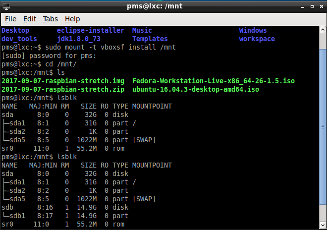

#Raspberry Pi 安装

##准备工作
首先到[官网](https://www.raspberrypi.org/downloads/raspbian/)下载raspbian镜像。然后用lsblk命令查看ubuntu上挂载的设备，插上TF卡之后，再用lsblk查看一下，从二次命令输出的不同之处，找到挂载的TF卡。如图所示，找到的TF卡为sdb：

##安装raspbian镜像到TF卡
首先通过unzip命令将下载的zip安装包解压，之后用`sudo dd bs=4M if=./2017-09-07-raspbian-stretch.img of=/dev/sdb conv=fsync`命令将2017-09-07-raspbian-stretch.img写到sdb的TF卡。

写入完成之后，挂载TF，并到boot分区，执行`touch ssh`生成一个空的ssh文件，以方便远程登录

将TF卡插入到raspberry pi中，打开电源启动树梅派

##配置raspberry pi
通过ssh登录到PI上，用户名为pi，密码为raspberry

- 更换源：根据[USTC Mirror Help](http://mirrors.ustc.edu.cn/help/raspbian.html)上的说明更换`/etc/apt/sources.list`中的内容。删除/etc/apt/sources.list.d/rasp.list。然后执行`sudo apt-get update`

- 安装docker及修改docker仓库地址：`sudo apt-get install docker.io`安装成功之后，在/etc/default/docker文件中增加`DOCKER_OPTS="--registry-mirror=https://docker.mirrors.ustc.edu.cn"`,然后执行`sudo service docker restart`重启docker服务

